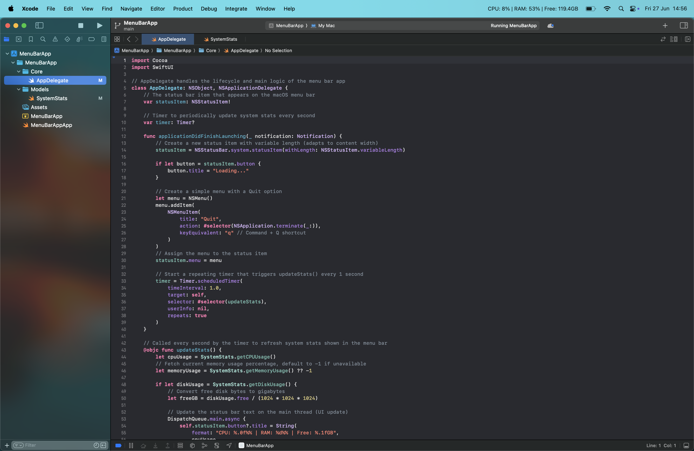
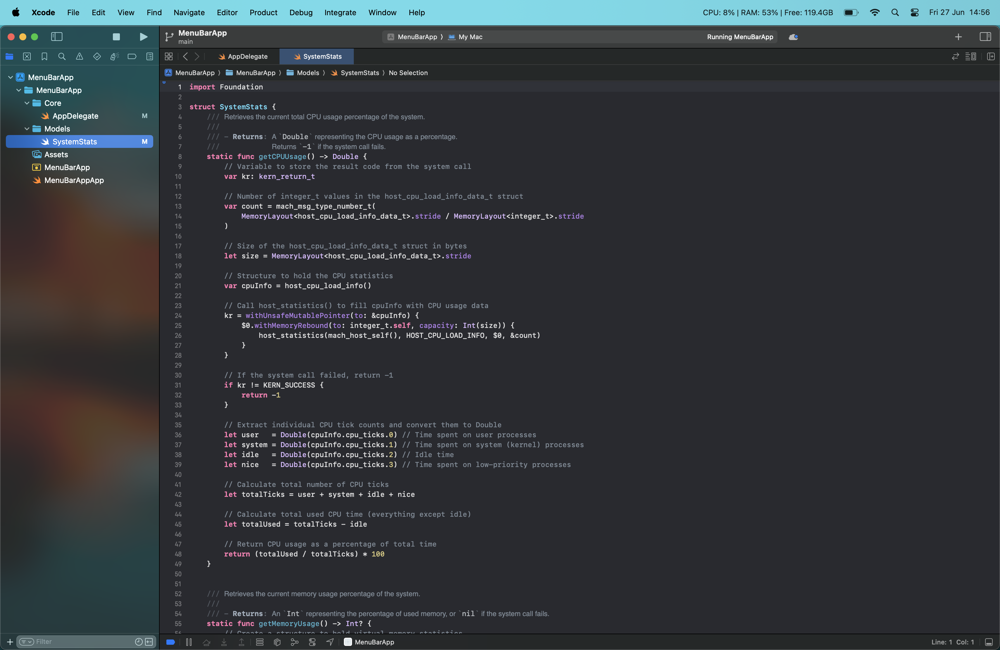

# MenuBarApp — macOS System Stats Monitor

MenuBarApp is a lightweight, Swift-based macOS menu bar application that displays real-time system resource usage directly in your menu bar. It shows live updates for:

- CPU Usage (%)
- Memory (RAM) Usage (%)
- Available Disk Space (GB)

The app uses native macOS APIs via host_statistics and FileManager to gather system metrics and updates them every second.

It’s built with Swift, SwiftUI, and AppKit (via AppDelegate) for seamless integration with the macOS status bar.

## Features
- Live system stats in your macOS menu bar
- Simple, clean text display — no popovers or windows
- Native macOS APIs for accurate system data
- Lightweight and efficient (no external dependencies)

## Tech Stack

- **Language:** Swift 
- **UI Framework:** SwiftUI, AppKit (NSStatusItem)
- macOS host_statistics APIs

## Usage
This project is for personal and portfolio use only — it is not distributed via the App Store.